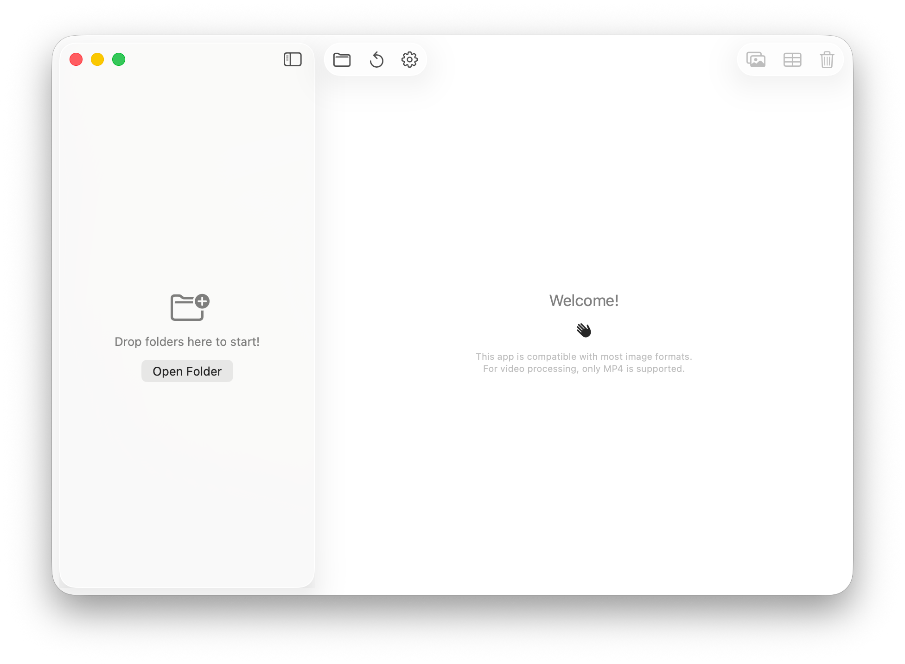
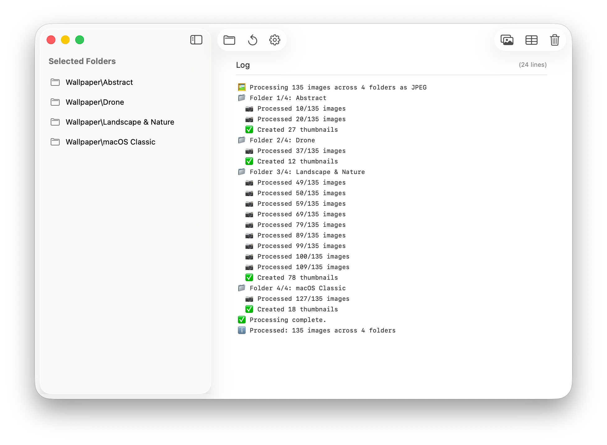

<div align="center">

# Thumbnailer  

<picture>
  <source srcset="Documentation/icon-dark.png" media="(prefers-color-scheme: dark)">
  <source srcset="Documentation/icon-light.png" media="(prefers-color-scheme: light)">
  
</picture>
<br/><br/>

A powerful **macOS app** for managing and processing photo & video collections with  
**automated thumbnail generation**, **contact sheet creation**, and  
smart media organization tools. ✨  

</div>


## 🖥️ Screenshots 

<p align="center">
    <a href="Documentation/App1.png"></a>
    <a href="Documentation/App2.png"></a>
</p>

## 🖥️ User Interface

### 🔍 Smart Content Detection

-   Auto-switches between **Photo Mode** and **Video Mode**
-   Supports major formats: JPG, HEIC, PNG, HEIC, MP4, and more

### 📸 Photo Processing

-   **Thumbnail Generation** 🖼️ → JPEG / HEIC, adjustable quality &
    sizing
-   **Contact Sheets** 🗂️ → Grid layouts (Stretch, Crop, Pad),
    customizable columns (1-20)
-   **SMB Optimized** ⚡ → Efficient on network drives

### 🎬 Video Processing

-   **Video Contact Sheets** 🎞️ → Smart frame sampling & layout
-   **Trim Intros/Outros** ✂️ → Cut seconds off start/end
-   **Flatten Folders** 📂 → Move videos up one level

### 🛠️ Specialized Tools

-   **Photo Tools**
    - Scan non-HEIC/JPEG
    - Convert to JPG / HEIC
    - Validate that thumbnails exist
    - Detect folders with low photo count (customizable)
    - Delete folders with no contact sheets
-   **Video Tools**
    - Scan for Non-MP4's 
    - Identify short videos (customizable)
    - Trim MP4 intros (customizable)
    - Trim MP4 outros (customizable)
    - Move videos from individual subfolders to their parent folder.
    - Delete videos with no contact sheets in the parent. 


### 🔔 Notifications & Status

-   **macOS Notifications** 🖥️ → Banner alerts when done
-   **Dock Badges** 🎯 → Show completion state
-   **Audio Alerts** 🔊 → For long jobs


### 🗂️ File Format Support

-   **Images** → JPG, PNG, HEIC, TIFF, BMP, WebP, GIF
-   **Videos** → MP4 fully supported; others detected but limited

### 📝 Logging

- Persistent logs in `~/Library/Logs/Thumbnailer/`

## 🔍 Troubleshooting

- **Running Slow?** - Hit the "Hide Log" eye button. If you're processing thousands of folders really quickly (like deleting thumbnail folders, or JPG/HEIC conversion), writing to the UI can lag. The text log will continue to update 


## 🖥️ Install & Minimum Requirements

- macOS 15.0 or later  
- **Apple Silicon only!**
- ~20 MB free disk space  


### ⚙️ Installation

Download from Releases. It's signed & notarized!

### ⚙️ Build it yourself!

Clone the repo and build with Xcode:

```bash
git clone https://github.com/gbabichev/thumbnailer.git
cd thumbnailer
open thumbnailer.xcodeproj
```

## 📝 Changelog

### 1.2.1
- Added "JFIF" as a supported JPG extension.

### 1.2
- 4x speed improvement in thumbnail & contact sheet generation. 
- 1.5x speed improvement in JPG conversion.
- 1.3x speed improvement in HEIC conversion. 
- 625x speed improvement in thumbnail verification. 
- Removed App Sandbox from web release so CMD+O actually works. 
- Fixed logging so it writes to disk & shows data correctly after hiding. 
- Updated app icon. 

### 1.1
- Fixed "cancel task" not working on deletion of thumbnail folders. 
- Added "Hide Log" to hide the log UI in case of thousands of files being processed - helps improve performance. 

### 1.0
- Initial release.

## 📄 License

MIT — free for personal and commercial use. 